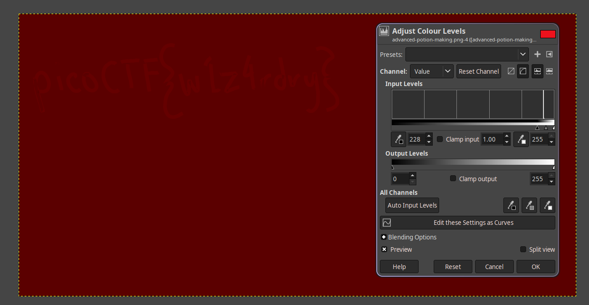

[← Natrag](..)

# Forenzika

## [Link na zadatke](../repo/navkis_forenzika_zadaci.zip)

...

 <!-- TODO -->

## Naredba
tr -> trim
base64 -> dekodira iz baze64 u ascii text
binwalk ->

# Slike

## Dolls.jpg
> Svi zadatci dostupni [ovdje](../repo/navkis_forenzika_zadaci.zip)

binwalk dolls.jpg -> zip arhiva

Nakon `binwalk -eM dolls.jpg`

I onda vidimo flag sa
```bash
$ cat extractions/dolls.jpg.extracted/4286C/base_images/2_c.jpg.extracted/2DD3B/base_images/3_c.jpg.extracted/1E2D6/base_images/4_c.jpg.extracted/136DA/flag.txt
picoCTF{[FLAG]}
```


## JPEG
- DCT kompresija
- YCbCr ne RGB
  - PAL, NTSC
- Kvantizacija -> lossy

- Y - luminace
- Cb - change blue
- Cr - change red

## PNG
- lossless
- LZ77 (kompresija)
  - prije kompresije filtrira
- RGB sa alfa kanalom (RGBA)
  - Prozirnost

## [Lista pocetaka filova i njigovih formata](https://en.wikipedia.org/wiki/List_of_file_signatures)

## Steganografija
Proces skrivanja podataka u slici

- LSB (least significant bit)
  - U zadnjem bitu skriva se podatak

### Advanced potion making
> Svi zadatci dostupni [ovdje](../repo/navkis_forenzika_zadaci.zip)

exittool kaze da se nalaze LSB na 1337 i nadalje

Mi možemo sa "Image Manipulation" alatom vidjet neke podatke.



## Entropija

Može se generirati sa `binwalk -E [file]`


# Zvuk
> Svi zadatci dostupni [ovdje](../repo/navkis_forenzika_zadaci.zip)

glavna stvar je gledati spectogram

# PCAP
> Svi zadatci dostupni [ovdje](../repo/navkis_forenzika_zadaci.zip)

- Mrežni promet
- Wireshark (http, ftp (stream))

