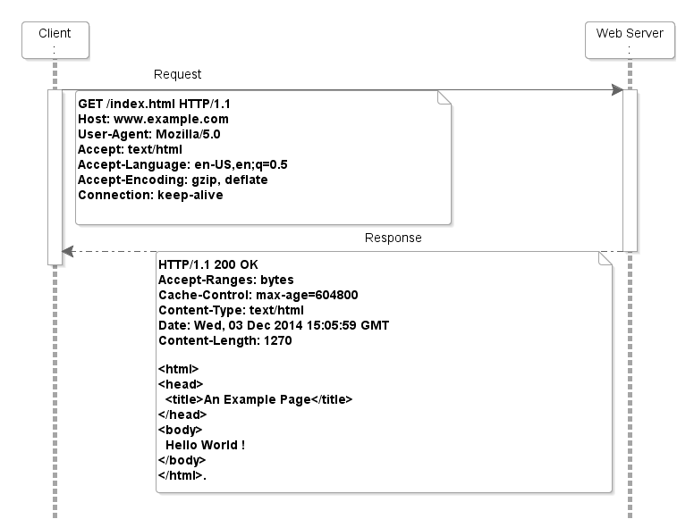

[← Natrag](..)

# Web Sigurnost - 1. dio

<!-- ## [Link na zadatke](../repo/navkis_kriptografija_zadaci.zip) -->

# Što je web aplikacija

Klijent-poslužitelj način komunikacije

Klijent
  - Chrome
  - FireFox
  - MS Edge
  - Opera

Poslužitelj
  - Apache
  - Nginx
  - IIS
  - Tomcat

Komunikacija je bazirana na HTTP(S) protokolu
  - Još mnogi drugi protokoli: DNS, Websockets, QUIC (streaming, baziran na UDP)

Primjer komunikacije između klijenta i servera


## Proxy
Posrednik u komunikaciji. Sve podatke koje šaljemo nekome prvo šaljemo proxy serveru i on ih prosljeđuje daje.

- Burp-Suite - alat za upravljanje IP requestovima
  - Automatsko skeniranje ranjivosti
  - Alat za promjenu formata podataka
  - Kriptografska analiza tokena
  - DNS, HTTP, SMTP server
  - Proxy - Man in the middle
  - Repeater - za ponavljanje zahtjeva

- [Webhook.site](https://webhook.site)
  - Za dobit vlastiti DNS name

# Koraci sigurnosti testiranja web aplikacija

- Prikupljanje što više informacija o aplikaciji i okolini
- Enumeracija i otkrivanje ranjivosti
- Iskorištavanje ranjivosti
- Dokumentiranje ranjivosti

## Enumeracija otvorenih portova

Za provjeru koji su portovi otvoreni koristiti:
```bash
nmap -sV -v [URL]
```

Moguće je definirati drugi range za testiranje sa `-p[OD_PORT]-[DO_PORT]`

## Enumeracija web aplikacija

Enumeracija dostupnih funkcionalnosti i okvirni pregled aplikacije

>[!note]
> HTTP zaglavlja često otkrivaju verziju poslužitelja i OS

Enumeracija JavaScript datoteka

Izlistavanje direktorija sa `inurl:/wp-content site:*.hr` na google-u

### Automatizirani alati za enumeraciju datoteka

- 301 - status code - redirect
- 404 - status code - not found

Alati:
  - Dirsearch
  - Ffuf
  - gobuster
  - feroxbuster

Bitno je odabrati dobru listu riječi
 - Ovisno o OS-u servera, jeziku aplikacije, vlasniku

Primjer pretraživanja domene `mach1ne.org` alatom dirsearch
```bash
$ dirsearch -u https://mach1ne.org

  _|. _ _  _  _  _ _|_    v0.4.3
 (_||| _) (/_(_|| (_| )

Extensions: php, aspx, jsp, html, js | HTTP method: GET | Threads: 25 | Wordlist size: 11460

Output File: /home/mateo/reports/https_mach1ne.org/_25-04-05_11-13-09.txt

Target: https://mach1ne.org/

[11:13:09] Starting:
[11:13:14] 403 -  199B  - /.ht_wsr.txt
[11:13:14] 403 -  199B  - /.htaccess.bak1
[11:13:14] 403 -  199B  - /.htaccess.save
[11:13:14] 403 -  199B  - /.htaccess.orig
[11:13:14] 403 -  199B  - /.htaccess_sc
[11:13:14] 403 -  199B  - /.htaccess_extra
[11:13:14] 403 -  199B  - /.htaccessOLD2
[11:13:14] 403 -  199B  - /.htaccess_orig
[11:13:14] 403 -  199B  - /.htaccess.sample
[11:13:14] 403 -  199B  - /.htaccessOLD
[11:13:14] 403 -  199B  - /.htaccessBAK
[11:13:14] 403 -  199B  - /.htm
[11:13:14] 403 -  199B  - /.html
[11:13:14] 403 -  199B  - /.htpasswd_test
[11:13:14] 403 -  199B  - /.htpasswds
[11:13:14] 403 -  199B  - /.httr-oauth
[11:13:15] 301 -  232B  - /.js  ->  https://mach1ne.org/.js/
[11:13:16] 403 -  199B  - /.php
[11:13:42] 200 -    0B  - /content.php
[11:13:45] 403 -  199B  - /demos/
[11:13:49] 200 -  102KB - /favicon.ico
[11:13:58] 301 -  239B  - /javascript  ->  https://mach1ne.org/javascript/
[11:14:01] 200 -   19B  - /log.php
[11:14:01] 200 -   46B  - /log.txt
[11:14:22] 403 -  199B  - /server-status/
[11:14:22] 403 -  199B  - /server-status
[11:14:31] 403 -  199B  - /test/
[11:14:31] 301 -  233B  - /test  ->  https://mach1ne.org/test/
[11:14:36] 200 -    0B  - /vendor/autoload.php
[11:14:36] 200 -    0B  - /vendor/composer/autoload_real.php
[11:14:36] 403 -  199B  - /vendor/
[11:14:36] 200 -    0B  - /vendor/composer/autoload_psr4.php
[11:14:36] 200 -    0B  - /vendor/composer/ClassLoader.php
[11:14:36] 200 -    0B  - /vendor/composer/autoload_static.php
[11:14:36] 200 -    0B  - /vendor/composer/autoload_classmap.php
[11:14:36] 200 -    0B  - /vendor/composer/autoload_namespaces.php

Task Completed

~ took 1m35s
$
```

## GET/POST

GET $\Rightarrow$ šalje podatke u url-u
POST $\Rightarrow$ šalje podatke u tjelu zahtjeva

## Cross-Site Scripting
Ubacivanje zlonamjernog JavaScript koda u web stranicu
  - `<script>alert(+XSS')</script>`
  - ``
  - `<input autofocus onfocus=alert('XSS')>`

### Reflektirajući XSS
Parametrizirani URL se reflektira bez sanitizacije u stranicu

`https://fer.unizg.hr/lib/ajax_autocomplete_search.php?aaa`

Sa XSS-om moguće je skoro sve što može i žrtva
  - Krađa kolačića, krivotvorenje malicioznih zahtjeva
  - Često preuzimanje kontrole žrtvinog računa

### Pohranjeni XSS
Ubacivanje JS-a u neku komponentu unutar aplikacija
- JS se sprema u bazu ili na disk poslužitelja te potom reflektira negdje drugdje u aplikaciji

### Ostali tipovi
- DOM (Document Object Model) XSS
- Blind XSS
- Self-bazirani XSS
- Server-Side XSS

### Obrane od XSS napada
- Pretvoriti znakove `<`, `>`, `"`, `'` u njihove tekstualne verzije: `&lt`, `&gt`, `&quot`, `&apos`
- Korištenje klijentskoj XSS filtera
- CSP - dozvoliti samo s određenih domena JS


## CSRF
> [PortSwigger](https://portswigger.net/web-security/all-labs) za igranje sa raznim ranjivostima

- Cross-Site Reqzest-Forgery (CSRF)

Ideja je podvaliti žrtvi HTTP zahtjev kojega ne bi inače poslali
  - Promjena lozinke ili email-a

### Kako krivotvoriti zahtjev

  1. Korisnik mora biti prijavljen u aplikaciju (kolačići aktivni)
  2. Korisnik klikne na link napadačeve stranice
  3. Stranica napadača šalje HTTP zahtjev na ranjivu app
  4. Browser u zahtjev automatski dodaje kolačiće
  5. Browser ne zna da se dogodlilo nešto loše, zahtjev je prihvaćen od aplikacije

## Same-Site i Cross-Site

Sve je Same-Site dok se ne mijenja protokol i TLD+1 (example.com)
npr. test.exaple.com i www.example.com su Same-Site

To je problem jer su fer.unizg.hr, foi.unizg.hr itd. su sve Same-Site
  - potrebno je u browseru omogućiti mitigavacije tima Same-Site cookies = strict

### Anti-CSRF tokeni
Tokeni koje znaju korisnik i server, pa se komunikacija može potvrditi

## SQL Injection
Umetanje SQL koda u forme kako bi se pokrenuo neki maliciozan SQL kod.

Otkrivanje SQL ranjivosti:
  - `'` = HTTP 500 statusni kod
  - `' '` = HTTP 200 statusni kod

Automatatizirani način [SQLmap](https://github.com/sqlmapproject/sqlmap/wiki/Usage)

```bash
python sqlmap.py -u [URL]
```

### Spriječavanje
- Koristiti biblioteke od razvojnih okvira
- Parametrirani upiti (Prepared statements)

## Napadi na prijavu

  - Default lozinke: `admin:admin`, `test:test`, `tomcat:tomcat`
  - Napradi grubom silom
  - Enumeracija i validacija korisnika
  - Nedovoljna autentikacija na određene krajnje točke
  - SQL Injection u prijavi = zaobilazak prijave
  - LDAP Injection u prijavi = zaobilazak prijave
    - umjesto `'` korsti `*` pa `**` i gledati error code

### Napad na dvofaktorsku autentikaciju

Ukoliko je implementirana u dva zasebna koraka
  1. Unos korisničkog imena, lozinke
  2. Unos 2FA koda

Jesu li koraci povezani?

Vraća li se sesija od korisnika nakon unosa lozinke ili 2FA koda
  - Nakon lozinke $\Rightarrow$ Nije potrebno unositi 2FA kod za pristup
  - Nakon 2FA koda $\Rightarrow$ Nije potrebno unositi lozinku za pristup

Preporuke za implementaciju 2FA
  - Ograničiti broj upita po jedinici vremena
  - ili implementacija dobre Captche (Google Captcha, Hcaptcha, ...)

  - Svaki korak povezati tokenom
  - Alternativa, sve poslati u jednom koraku
    - Validacija usrname + lozinka + 2FA zajedno

## Kontrola pristupa
> Najčešće u praksi

Web aplikacije imaju često više korisnika i rola

Može li niže privilegirani korisnik neautorizirano prisupiti krajnjim točkama koje su namijenjene za više privilegirane korisnike


### Logičke ranjivosti
  - Slanje novca sa tuđih računa
  - Slanje negativnih iznosa
  - Manipulacija vrijednosti određene valute
    - Slanje između EUR i YEN-a
  - Korištenje istog kupona više puta

### Izravna poveznica na objekt (DOR)

- `/user?id=1`
- `/user?uuid=1c23a782-aa5a-4416-8d1b-726b9bd1d13f`
- `/user?oib=12345678912`
- `/user?email=netko@gmail.com`

U svim ovim slučajevim se može naći taj podatak i pristupiti specifičnom korisniku

Obrana:
  - Provjera prava pristupa
  - Validirati na **poslužiteljskoj** strani

### Web Aplication Firewall (WAF)

Zahtjev **MORA** proći kroz firewall da bi išta radilo.

Lagano se bypass-a jer je često miskonfiguriran.

- WafW00f

## XSS - vrijance
  - Web security je JAKO široko područje
  - Nemoguće je pokriti sve ranjivosti
  - Penetracijska testiranja nisu više dovoljna protiv state-sponzoriranih napadača (imaju pristup zero-day ranjivostima)
